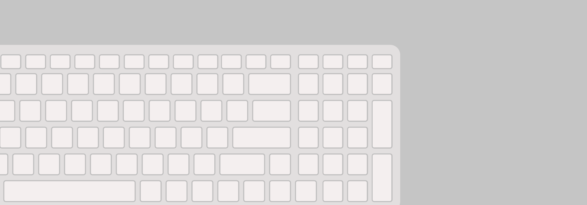
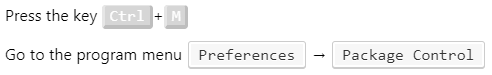

# Changing style of the kbd tag



On the Internet I met that in the text of articles sometimes keyboard combinations are depicted by simulating images of buttons. This is done with the tag `<kbd>` and its design in CSS.

I use (**Update:** now I do not use these styles) in the articles two types of design tag `<kbd>`: to display buttons and menu items in programs that need to go.

Add the following code to your CSS file:

```css
kbd {
  margin: 0;
  padding: 0;
  border: 0;
  outline: 0;
  color: white;
  font-size: 100%;
  font-family: monospace, sans-serif;
  vertical-align: baseline;
  background: transparent;
  border-color: #e6e6e6 #bebebe #bebebe #e6e6e6;
  border-style: solid;
  border-width: 1px 3px 4px;
  padding: 0 5px;
  background-color: #d2d2d2;
  background-color: rgba(210, 210, 210, 0.9);
  -webkit-border-radius: 4px;
  -moz-border-radius: 4px;
  border-radius: 4px;
}

kbd.menu {
  -moz-border-radius: 3px;
  -moz-box-shadow: 0 1px 0 rgba(0, 0, 0, 0.2), 0 0 0 2px #fff inset;
  -webkit-border-radius: 3px;
  -webkit-box-shadow: 0 1px 0 rgba(0, 0, 0, 0.2), 0 0 0 2px #fff inset;
  background-color: #f7f7f7;
  border: 1px solid #ccc;
  border-radius: 3px;
  box-shadow: 0 1px 0 rgba(0, 0, 0, 0.2), 0 0 0 2px #fff inset;
  color: #333;
  display: inline-block;
  font-family: monospace, sans-serif;
  font-size: 100%;
  line-height: 1.4;
  margin: 0 0.1em;
  padding: 0.1em 0.6em;
  text-shadow: 0 1px 0 #fff;
}
```

Example of using styles:

```html
<p>Press the key <kbd>Ctrl</kbd> + <kbd>W</kbd></p>

<p>Go to the program menu <kbd class="menu">Preferences</kbd> → <kbd class="menu">Package Control</kbd></p>
```

As a result, you will get this result.

Screenshot:



Example in CodePen:

<https://codepen.io/Harrix/pen/pZZZxg>
