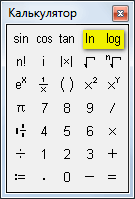
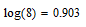
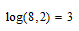

# Logarithm of base 2 in Mathcad

Some people are confused when in `Mathcad` (e.g. version 15) they see only two logarithms in the list of operators: natural and decimal.

The operators panel in the `Mathcad 15`:

How to calculate logarithm, e.g., base 2: $log_2 8$?

It's simple. When you write a decimal logarithm, then enter the base you need, separated by a comma. A base 10 is just the default:

